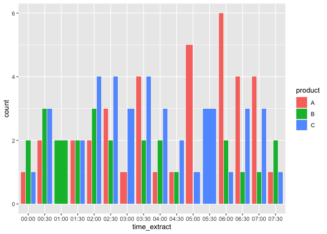
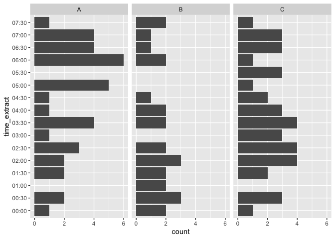
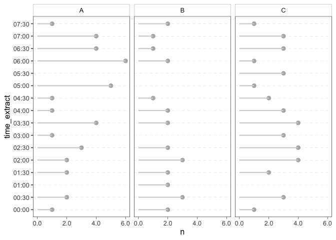

Add muliple data points to a ggplot
================

## Load libraries

``` r
library(ggplot2)
library(dplyr)
library(lubridate)
library(ggthemes)
library(scales)
```

## Generate Data

``` r
my_data <- data.frame(product = sample(LETTERS[1:3], 100, replace = TRUE),
                      arrival_time = ISOdatetime(2020, 5, 20, 0, 0, 0) + sample(1:27000, 100))
```

### Round time to nearest 30 minutes and extract time as string

``` r
my_data <-  my_data %>%
  mutate(round_mins = round_date(arrival_time, unit = "30 minutes"),
         time_extract = strftime(round_mins, format="%H:%M"))
```

## Create a simple bar chart with the count

``` r
ggplot(data = my_data, aes(x = time_extract,
                           fill = product)) + 
  geom_bar(position = "dodge2")
```

<!-- -->

## Better facet bar chart

This depends how many categories one has. Too many categories will not
look good and the plot will be unhelpful.

``` r
ggplot(data = my_data, aes(y = time_extract)) +
  geom_bar() +
  facet_wrap(~product)
```

<!-- -->

## Another option: a dot chart

### Let’s get the counts first

``` r
my_data_counts <- count(my_data, product, time_extract)
```

### Dot chart

``` r
ggplot(my_data_counts, aes(x = n, y = time_extract)) +
  scale_x_continuous(labels = comma) +
  geom_point(shape = 21, fill = "grey70", color = "grey70", size = rel(2.5)) + #  plot add points
  # add line segments connecting to the points
  geom_linerange(aes(group = time_extract, xmax = n, xmin = 0),
    color = "lightgray",
    size = rel(0.8)
  ) +
  facet_wrap(~product) +
  theme_few() +
  theme(
    panel.grid = element_blank(),
    panel.grid.major.y = element_line(size = rel(0.075), linetype = "dashed"),
    strip.background.x = element_rect(fill = "white", color = "grey80"),
    axis.ticks.x = element_line(size = rel(0.5))
  )
```

<!-- -->
