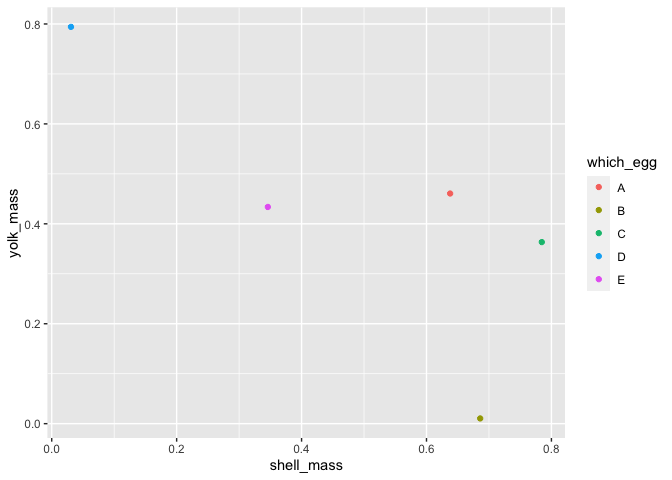
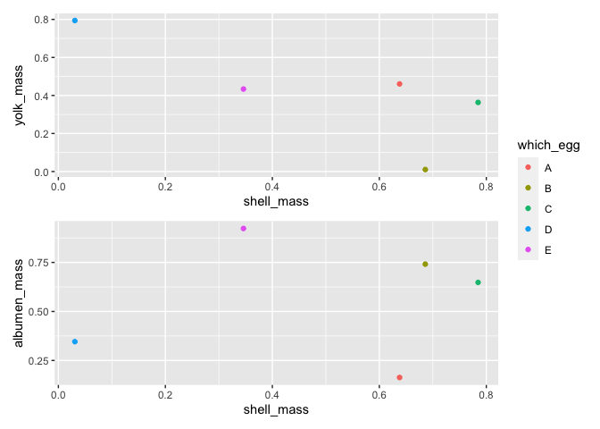

Multiple lines of fit and scatter plots using ggplot
================
Ashutosh Nandeshwar

I created this script for this question on my [channel on
Youtube](https://youtu.be/_gl-CNA7wck)

    How would you make multiple lines for different variables? I.e ones that are not grouped. For example, 
    I have a data frame with the Egg mass of a quail egg, and I want to compare the shell mass with each of the egg components 
    (Shell mass, yolk mass and albumen mass). Each of those components are under a new column in my data frame: 
    How would I plot them all on the same graph against the egg mass?

## Load libraries

``` r
library(ggplot2)
library(dplyr)
```

    ## 
    ## Attaching package: 'dplyr'

    ## The following objects are masked from 'package:stats':
    ## 
    ##     filter, lag

    ## The following objects are masked from 'package:base':
    ## 
    ##     intersect, setdiff, setequal, union

``` r
library(patchwork)
library(tidyr)
```

## Create a test data frame

``` r
my_df <- data.frame(matrix(runif(15), ncol = 3)) %>%
  mutate(which_egg = LETTERS[1:5]) %>%
  rename(shell_mass = X1,
         yolk_mass = X2,
         albumen_mass = X3)
```

## A simple scatter plot of shell mass vs yolk mass

``` r
g1 <- ggplot(data = my_df, aes(x = shell_mass, y = yolk_mass, color = which_egg)) +
  geom_point()

g1
```

<!-- -->

## Another scatter plot of shell mass vs albumen mass

``` r
g2 <- ggplot(data = my_df, aes(x = shell_mass, y = albumen_mass, color = which_egg)) +
  geom_point()

g2
```

<!-- -->

## Combine both scatter plots using `patchwork`

``` r
g1 + g2 + plot_layout(ncol = 1, guides = 'collect')
```

<!-- -->

## Try plotting both plots in one plot (I don’t recommend this)

``` r
ggplot(data = my_df, aes(x = shell_mass, y = yolk_mass)) +
  geom_point(color = "black") +
  geom_point(data = my_df, aes(x = shell_mass, y = albumen_mass), color = "blue")
```

<!-- -->

But perhaps you were looking for the following solution.

## Collapse columns into rows using `tidyr`

``` r
collapsed_df <- gather(my_df, key = "what", value = "measure", -which_egg, -shell_mass)
```

## Plot lines of fit

``` r
ggplot(data = collapsed_df, aes(x = shell_mass, y = measure, color = what)) +
  geom_point() + 
  geom_smooth() # loess fit
```

    ## `geom_smooth()` using method = 'loess' and formula 'y ~ x'

<!-- -->
